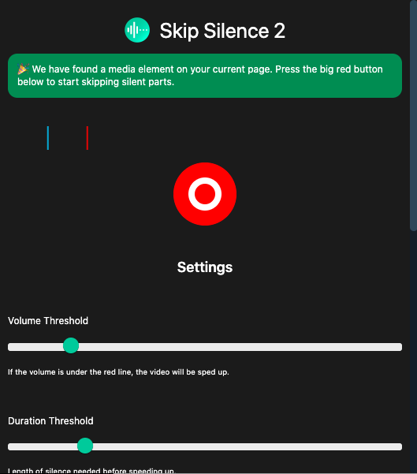
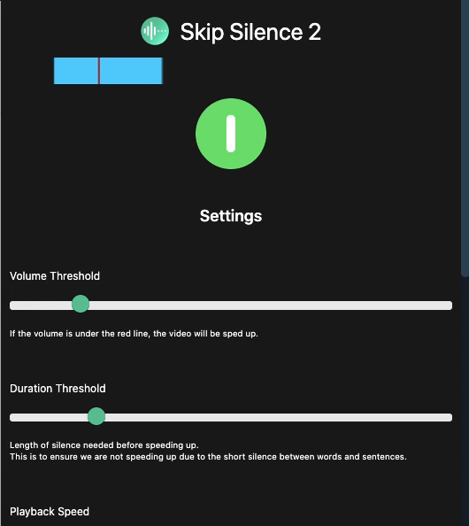

     
    

# Skip Silence
"Skip Silence" is a browser extension that allows you to autmatically skip parts of a video that are silent.
It is highly inspired by CaryKH's [automatic on-the-fly video editing tool](https://www.youtube.com/watch?v=DQ8orIurGxw).
The extension works with most websites that use HTML5 `audio` and `video` elements (like YouTube).

## Demo

(Video used: Unedited part of <https://youtu.be/DQ8orIurGxw?t=234>)

## Installation
"Skip Silence" is availible through the [chrome web store](https://chrome.google.com/webstore/detail/skip-silence/fhdmkhbefcbhakffdihhceaklaigdllh).
You can also install this extension on Chrome by downloading the source from GitHub and loading the unpacked extension through "chrome://extensions" as a "Temporary Add-On".

## Why is Firefox unsupported?
"Sip Silence" uses JavaScript's video.playbackRate and MediaSourceElement simultaneously to achieve its effect. Unfortunately, Firefox currently [has a bug](https://bugzilla.mozilla.org/show_bug.cgi?id=1517199) that stops video.playbackRate from working when already using MediaSourceElement - making this extension useless.

## Usage
When "Skip Silence" detects a compatible element on the current page, its icon in the menubar will be colored.

You can now click on this icon to reveal the settings popup.

You can now:
- Click the big red button to enable and disable "Skip Silence" for the current page
- Change "Skip Silence"'s settings
- View the current volume using the VU meter
  - The VU Meter will be blue when on normal speed and green when currently in a silent part
  - The red line represents your current volume threshold

## Limitations
- Will only work when the tab is in focus. It will not work if the tab is in the background
- The first few samples after a silent part may be skipped or will clip
- Won't work on sites that use other methods to play video or audio (e.g. Spotify Web Player)

## How does it work?
The extension attaches a JavaScript audio analyser to the current video or audio source and will speed up or slow down the video using the current volume of the audio. This unfortunately results in the first few samples of audio after a period of silence will still be sped up.

## Contributing
Please fork this repository and create a new pull request to contribute to it.

If you notice any errors, please create a new issue on GitHub.

## License
Licensed under the [MIT License](LICENSE)
